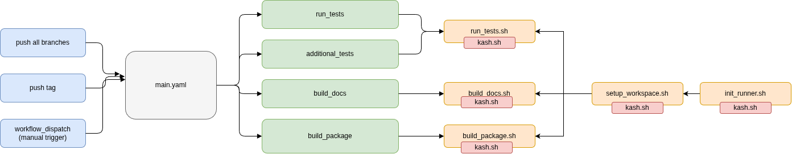
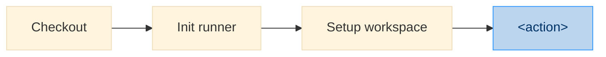
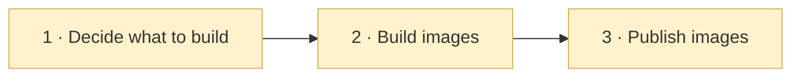
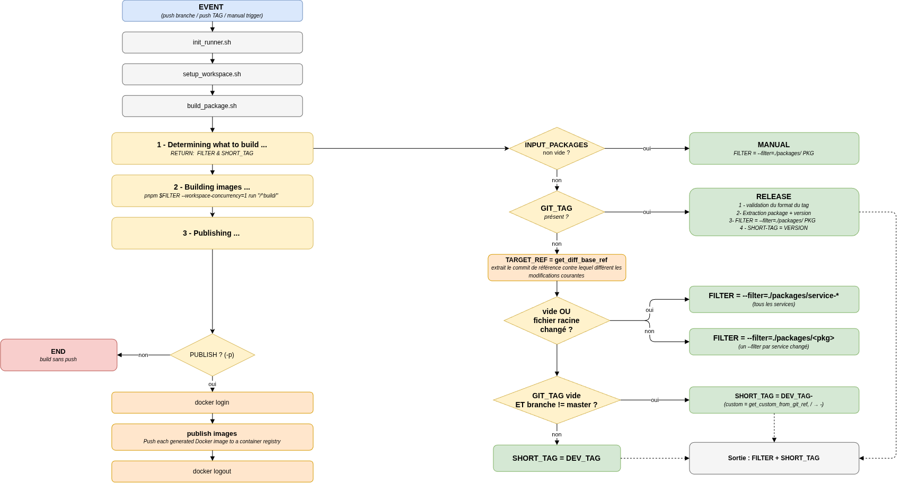
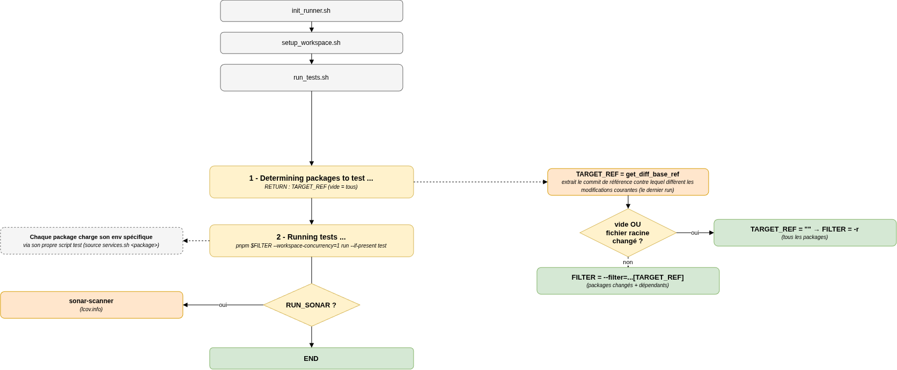
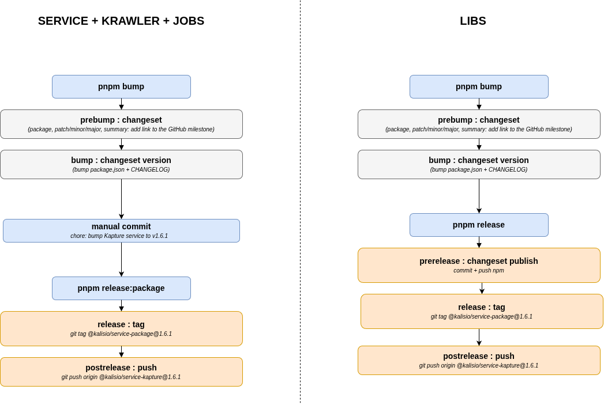

# Continuous Integration



## Triggers

| Trigger | What happens |
|---------|--------------|
| `push` on **`master`** | tests + images published with the `dev` tag |
| `push` on **any other branch** | tests + images published with a `dev-<branch>` tag |
| `push` of a **release tag** `@<scope>/<pkg>@<ver>` | the image is published with the version as tag |
| **manual** (`workflow_dispatch`) | run any job on demand: `run_tests`, `additional_tests`, `build_docs`, `build_package` |

## Jobs

Every job runs the same sequence of steps :



| Job | Script | Result |
|-----|--------|--------|
| **run_tests** | `run_tests.sh` | Tests + Sonar coverage |
| **additional_tests** | `run_tests.sh` | Tests on a node matrix |
| **build_docs** | `build_docs.sh` | Documentation |
| **build_package** | `build_package.sh` | Service Docker images |

## `build_package`



Phase **1** is the heart of it & the whole CI's core idea: **`pnpm --filter` picks only the impacted packages**. From the git context, `build_package` resolves **which packages to build** (`FILTER`) and **which tag** the image gets (`SHORT_TAG`):



| Context | Packages built (`FILTER`) | Image tag |
|---------|---------------------------|-----------|
| push on **`master`** | the changed packages `--filter=./packages/<pkg>` (or `--filter=./packages/service-*` if a shared file changed) | `dev` |
| push on **another branch** | same | `dev-<branch>` |
| **manual** | the packages you pick `--filter=./packages/<pkg>` | `dev` / `dev-<branch>` |
| **release tag** (e.g `@…/service-kapture@1.6.0`) | that one package `--filter=./packages/<pkg>` | the version (e.g `1.6.0`) |

:::tip Several packages
one `--filter` each — e.g. `--filter=./packages/service-kapture --filter=./packages/service-k2`
:::

:::info Configuration

| Setting | Meaning |
|---------|---------|
| `PACKAGE_PREFIX` | buildable packages |
| `DOCKER_NAMESPACE` | Docker Hub org (must match the package.json) |
| `DEV_TAG` | base dev tag (`dev` / `dev-<custom>`) |
| `MAIN_BRANCH` | branch that gets the plain dev tag |
| `EXTRA_FULL_REBUILD_PATHS` | extra globs forcing a full rebuild |
:::

## `run_tests`

`run_tests` works in two phases:

1. **Determine the impacted packages** : `pnpm --filter` picks what changed (all packages if a shared file changed).
2. **Run their tests**



## Release

```bash
pnpm bump  # version + CHANGELOG, then commit
pnpm release:<pkg>   # git tag + git push
```


