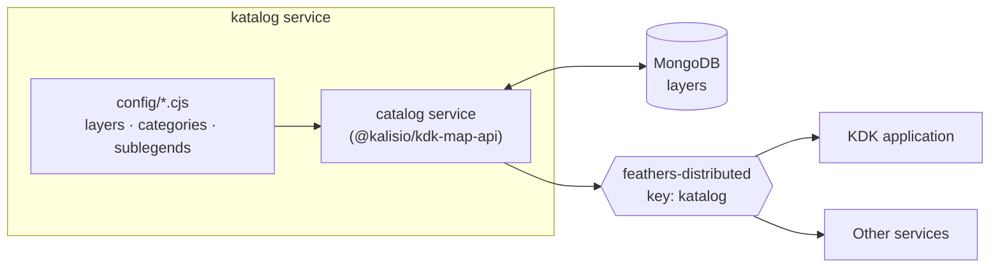
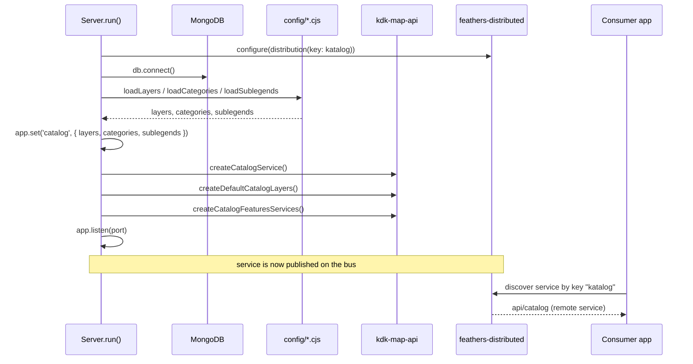

# Katalog

_Catalog service for KDK-based applications._

## Overview

**katalog** is a [Feathers](https://feathersjs.com/) microservice — built on top of the
[**kdk-ekosystem**](https://github.com/kalisio/kdk-ekosystem) packages
([`@kalisio/kdk-core-api`](https://github.com/kalisio/kdk-ekosystem/tree/master/packages/kdk-core-api)
for the base application and
[`@kalisio/kdk-map-api`](https://github.com/kalisio/kdk-ekosystem/tree/master/packages/kdk-map-api)
for the catalog service and geospatial layer model) — that serves a **catalog of map layers** to
KDK-based applications. It centralizes the definition of:

- **Layers** — the base maps, overlays and terrain layers that an application can display
  (base maps, weather, hydrography, administrative boundaries, sensors, …).
- **Categories** — how those layers are grouped and presented in the application UI.
- **Sublegends** — additional legend entries attached to the catalog.

Instead of each application embedding its own hard-coded list of layers, the layers are
described once as data in `katalog` and exposed through a single `catalog` service. The
service is published over [`@kalisio/feathers-distributed`](https://github.com/kalisio/feathers-distributed),
so any other service or application sharing the same distribution **key** can discover and
query the catalog remotely, without a direct HTTP coupling.

Layer definitions live in MongoDB (and can therefore be created, patched and removed at
runtime), while categories and sublegends are injected from the configuration files on
startup.



## Developing

### Source layout

| File | Responsibility |
| --- | --- |
| [`src/main.js`](https://github.com/kalisio/services-ekosystem/blob/master/packages/katalog/src/main.js) | Entry point — creates the server and calls `run()`. |
| [`src/server.js`](https://github.com/kalisio/services-ekosystem/blob/master/packages/katalog/src/server.js) | `Server` class: builds the KDK app, configures distribution, loads the catalog and starts listening. |
| [`src/layers.js`](https://github.com/kalisio/services-ekosystem/blob/master/packages/katalog/src/layers.js) | `loadLayers` / `loadCategories` / `loadSublegends` — glob and evaluate the `config/**/*.cjs` files. |
| [`src/services/index.js`](https://github.com/kalisio/services-ekosystem/blob/master/packages/katalog/src/services/index.js) | Registers the `catalog` service from `@kalisio/kdk-map-api`. |
| [`src/logger.js`](https://github.com/kalisio/services-ekosystem/blob/master/packages/katalog/src/logger.js) | Winston logger configuration. |

### Startup flow

On `server.run()` the service performs the following steps:



### Configuration files

All catalog content is described as plain CommonJS modules under
[`config/`](https://github.com/kalisio/services-ekosystem/tree/master/packages/katalog/config),
each exporting a function that returns an array of definitions:

```
config/
├── default.cjs              # app + distribution configuration
├── layers/                  # 26 files grouped by theme
│   ├── basemap/             # ign, osm, cesium, imagery, k2
│   ├── weather/             # forecast, awc, weatherlink, meteofrance, …
│   ├── hydrography/         # hubeau, flood, vigicrues
│   ├── administrative/      # osm-boundaries, adminexpress, demography
│   └── …
├── categories/              # how layers are grouped in the UI
└── sublegends/              # extra legend entries
```

The loaders glob every `*.cjs` file in the corresponding directory and call it with a
**context** object so that endpoints can be templated from the environment:

```js
// layers.js — context passed to each layer file
const context = { wmtsUrl, tmsUrl, wmsUrl, wcsUrl, k2Url, s3Url, ...app.get('catalog') }
```

A layer file therefore looks like:

```js
module.exports = function ({ wmtsUrl, tmsUrl, wmsUrl, wcsUrl, k2Url, s3Url }) {
  return [{
    name: 'Layers.WIND_TILED',
    type: 'OverlayLayer',
    tags: ['weather', 'forecast'],
    i18n: { /* fr / en labels */ },
    // …
  }]
}
```

Categories receive the same context plus `domain`, and sublegends receive no context.

To add a new layer, drop a `*.cjs` file (or extend an existing one) under the relevant
`config/layers/<theme>/` directory — it is picked up automatically on the next start.

## Installation

### Prerequisites

- [Node.js](https://nodejs.org/) `>= 20.19.0`
- [pnpm](https://pnpm.io/) `10.x`
- A running [MongoDB](https://www.mongodb.com/) instance

This package is part of the `services-ekosystem` pnpm workspace and depends on the
`kdk-ekosystem` packages (`@kalisio/kdk-core-api`, `@kalisio/kdk-map-api`) which are
referenced as local links.

### Install

```bash
# from the repository root
pnpm install
```

### Run

```bash
# from packages/katalog
pnpm dev      # start in watch mode (node --watch src/main.js)
pnpm build    # produce the dist/ bundle with Vite
```

By default the service listens on **port 8187** and connects to
`mongodb://127.0.0.1:27017/katalog`.

## Configuration

The service is configured through [`@feathersjs/configuration`](https://feathersjs.com/api/configuration.html),
i.e. [`config/default.cjs`](https://github.com/kalisio/services-ekosystem/blob/master/packages/katalog/config/default.cjs)
overridden by environment variables.

### Application settings

| Key | Default | Description |
| --- | --- | --- |
| `apiPath` | `/api` | Base path for services (the catalog is exposed at `api/catalog`). |
| `host` | `localhost` | Bind host (`HOSTNAME` env var). |
| `port` | `8187` | Listening port (`PORT` env var). |
| `db.url` | `mongodb://127.0.0.1:27017/katalog` | MongoDB connection string. |
| `paginate` | `{ default: 10, max: 50 }` | Default pagination for `find`. |

### Feathers Distributed

`katalog` publishes its services on the distribution bus so remote consumers can use them
without a direct HTTP call. The relevant block of `config/default.cjs`:

```js
distribution: {
  key: 'katalog',                 // this service's own distribution identity
  authentication: false,
  publicationDelay: 5000,
  heartbeatInterval: 10000,
  timeout: 30000,
  services: (service) => true,    // publish every local service on the bus
  distributedMethods: ['find', 'get', 'create', 'update', 'patch', 'remove'],
  distributedEvents: ['created', 'updated', 'patched', 'removed'],
  middlewares: { after: express.errorHandler() }
}
```

Three options control distribution:

- **`key`** — this application's *own* identity. Every service `katalog` publishes is
  tagged with this key (`'katalog'`).
- **`services`** — a predicate selecting which *local* services to publish. `katalog`
  publishes all of them (`() => true`).
- **`remoteServices`** — a predicate (used by consumers) selecting which *remote*
  services to consume.

A consumer discovers `katalog` by matching the **producer's** key in its `remoteServices`
predicate — the consumer's own `key` is just its own identity and does **not** need to
equal `'katalog'`:

```js
import distribution from '@kalisio/feathers-distributed'

consumer.configure(distribution({
  key: 'my-app',                                      // the consumer's own identity (arbitrary)
  services: () => false,                              // this consumer publishes nothing
  remoteServices: (service) => service.key === 'katalog'  // consume katalog's services
}))

// once discovered, the catalog is available as a normal Feathers service
const layers = await consumer.service('api/catalog').find({
  query: { type: 'OverlayLayer', tags: { $in: ['administrative'] } }
})
```

A consumer whose `remoteServices` predicate does not match `service.key === 'katalog'`
will **not** discover the catalog services.

### Environment variables

Here are the environment variables you can use to customize the service:

| Variable | Description | Defaults |
| --- | --- | --- |
| `HOSTNAME` | The hostname to be used when exposing the service | `localhost` |
| `PORT` | The port to be used when exposing the service | `8187` |
| `SUBDOMAIN` | The base domain used to build the default map URLs (e.g. `wmtsUrl = https://mapcache.<SUBDOMAIN>/mapcache/wmts/1.0.0`) | `test.kalisio.xyz` |
| `API_GATEWAY_URL` | When set, all map URLs are derived from this single gateway instead of the per-service hosts (e.g. `wmtsUrl = <API_GATEWAY_URL>/wmts/1.0.0`) | |
| `K2_URL` | Explicit override for the K2 endpoint | derived from `SUBDOMAIN` / `API_GATEWAY_URL` |
| `S3_URL` | Explicit override for the S3 endpoint |  |
| `LAYERS_FILTER` | Selects which layers are loaded into the catalog, by layer name (see below) | `*` |

`LAYERS_FILTER` is a space- or comma-separated list of
[minimatch](https://github.com/isaacs/minimatch) patterns matched against each layer's
`name` (the `Layers.` prefix is stripped). A pattern prefixed with `-` excludes matching
layers:

```bash
LAYERS_FILTER='*'                 # all layers (default)
LAYERS_FILTER='WIND*'             # only layers whose name starts with WIND
LAYERS_FILTER='* -WIND_TILED'     # every layer except WIND_TILED
```

## Deploying

This service is designed to be deployed using the [Kargo](https://github.com/kalisio/kargo)
project.

## Testing

Tests are written with [Vitest](https://vitest.dev/) and require a reachable MongoDB
instance (see [`config/test.json`](https://github.com/kalisio/services-ekosystem/blob/master/packages/katalog/config/test.json)).

```bash
# from packages/katalog
pnpm test     # vitest run --coverage
```

Two suites are provided:

- [`test/app.test.js`](https://github.com/kalisio/services-ekosystem/blob/master/packages/katalog/test/app.test.js) —
  boots the server and checks that unknown routes return a 404 JSON error and that the
  `catalog` service is populated with layers on startup.
- [`test/distribution.test.js`](https://github.com/kalisio/services-ekosystem/blob/master/packages/katalog/test/distribution.test.js) —
  spins up a remote consumer and verifies service discovery over `feathers-distributed`,
  layer/category/sublegend queries, full CRUD via distribution, and that a consumer with
  the wrong key cannot discover the services.

## License

Licensed under the [MIT license](https://github.com/kalisio/services-ekosystem/blob/master/packages/katalog/LICENSE.md).

Copyright (c) 2026-present [Kalisio](https://kalisio.com)

## Authors

This project is sponsored by

[](https://kalisio.com)
