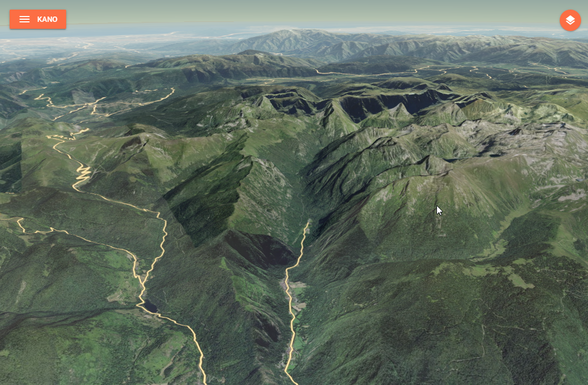
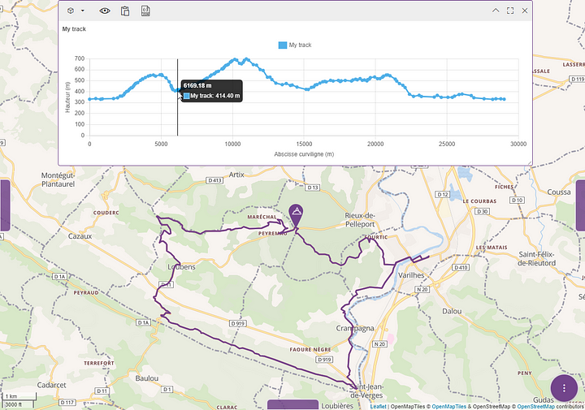

# service-k2

_3D terrain server for Cesium tiles_

## Overview

**service-k2** is a lightweight service that exposes different endpoints related to terrain data:

- a **3D terrain tiles** endpoint that lets you access quantized meshes stored in MBTiles for [Cesium](https://cesium.com/),
- an **elevation** endpoint that lets you compute the elevation of the terrain under a linear geographical element.





For 3D terrain tiles, the service always serves a single terrain file on the root path (`/`), taken from the `TERRAIN_FILEPATH` environment variable (default `/mbtiles/terrain.mbtiles`). In addition, if the `TERRAIN_FOLDER` environment variable is set, every `*.mbtiles` file found in that folder is also served, each under a path derived from its basename.

::: warning
Serving the single `TERRAIN_FILEPATH` file is always active, even when `TERRAIN_FOLDER` is set. That file must therefore exist, otherwise the service fails to start.
:::

## Data

**service-k2** needs data to serve, and its two features rely on **different datasets** — so to run the service locally (or in production) you have to provide the data for whichever feature you want to use:

- **3D terrain tiles** are served from **quantized-mesh `.mbtiles`** files, configured through `TERRAIN_FILEPATH` or `TERRAIN_FOLDER` (see [Configuration](#configuration)). See [Converting GeoTIFF to MBTiles](#converting-geotiff-to-mbtiles) to produce them.
- **Elevation computation** reads a **Digital Elevation Model (DEM/MNT)** in a GDAL-readable format (GeoTIFF or VRT). By default the DEM is picked from `/mbtiles` depending on the requested resolution:

  | Resolution | DEM file                      |
  |------------|-------------------------------|
  | `< 250 m`  | `/mbtiles/srtm.vrt`           |
  | `< 500 m`  | `/mbtiles/GMTED2010/mx75.tif` |
  | `< 1000 m` | `/mbtiles/GMTED2010/mx15.tif` |
  | otherwise  | `/mbtiles/GMTED2010/mx30.tif` |

  You can bypass this selection with the `demOverride` parameter, resolved relative to `/mbtiles`. Note that this `/mbtiles` root is **not** configurable through an environment variable. The `/elevation` endpoint also requires **GDAL** (`gdalwarp`) to be installed on the host or image at runtime.

## Installation

Install with your preferred package manager:

::: code-group

```bash [pnpm]
pnpm add @kalisio/service-k2
```

```bash [npm]
npm install @kalisio/service-k2
```

```bash [yarn]
yarn add @kalisio/service-k2
```

:::

## Configuration

Here are the environment variables you can use to customize the service:

| Variable           | Description                                                      | Defaults                   |
|--------------------|-----------------------------------------------------------------|----------------------------|
| `PORT`             | The port to be used when exposing the service                   | `8080`                     |
| `BODY_LIMIT`       | The size limit of the request body                              | `100kb`                    |
| `TERRAIN_FILEPATH` | Path to a single terrain `.mbtiles` file (single-file mode)     | `/mbtiles/terrain.mbtiles` |
| `TERRAIN_FOLDER`   | Path to a folder of `*.mbtiles` terrain files (multi-file mode) | -                          |


## API

The HTTP API exposed by **service-k2** is documented on the [API reference](./service-k2-openapi) page.


## Testing

The test suite uses [Vitest](https://vitest.dev/) and exercises the elevation computation against a bundled DEM through GDAL. It is skipped automatically when GDAL is not installed.

To run the tests, use the `test` script:

```bash
pnpm test
```

## Converting GeoTIFF to MBTiles

1. Run a [cesium-terrain-builder-docker](https://github.com/tum-gis/cesium-terrain-builder-docker) container with a volume mounted on the folder with your GeoTIFF files:

```bash
docker run -it --name ctb -v "./path/to/geotiff/:/data" tumgis/ctb-quantized-mesh
```

2. Build a virtual dataset with all of the GeoTIFF files:

```bash
gdalbuildvrt dataset.vrt /data/*.tif
```

3. Reproject data to EPSG:4326:

```bash
gdalwarp -s_srs EPSG:2154 -t_srs EPSG:4326 dataset.vrt dataset-EPSG4326.vrt
```

4. Build overview images:

```bash
gdaladdo -r average dataset-EPSG4326.vrt 2 4 8 16
```

5. Generate quantized meshes with [cesium-terrain-builder-docker](https://github.com/tum-gis/cesium-terrain-builder-docker?tab=readme-ov-file#create-cesium-terrain-files):

```bash
ctb-tile -f Mesh -C -N -o /target/path/for/generated/quantized/meshes/ dataset-EPSG4326.vrt
```

6. Generate `layer.json`:

```bash
ctb-tile -f Mesh -C -N -l -o /target/path/for/generated/quantized/meshes/ dataset-EPSG4326.vrt
```

7. Outside of the container, get the [`quantized_mesh2mbtiles.py`](https://github.com/kalisio/service-ekosystem/blob/master/packages/service-k2/tools/quantized_mesh2mbtiles.py) script from this project, and generate the MBTiles file from the quantized meshes:

```bash
python quantized_mesh2mbtiles.py /path/to/quantized/meshes/ terrain.mbtiles
```
